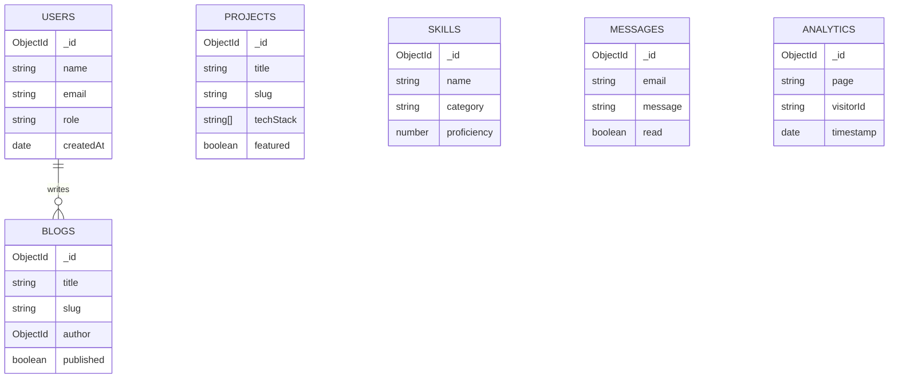

# API Contracts & Database ERD

## Entity Relationship Diagram

## REST API Contracts (/api/v1)

### Projects Module
| Method | Endpoint | Query Params | Request Body | Description |
|---|---|---|---|---|
| GET | `/projects` | `page, limit, sort, featured` | None | Fetch paginated projects |
| GET | `/projects/:slug` | None | None | Fetch single project by slug |
| POST | `/projects` | None | `CreateProjectDto` | Create new project (Admin) |
| PUT | `/projects/:id` | None | `UpdateProjectDto` | Update project (Admin) |
| DELETE | `/projects/:id` | None | None | Delete project (Admin) |

### Messages Module (Contact)
| Method | Endpoint | Query Params | Request Body | Description |
|---|---|---|---|---|
| POST | `/messages` | None | `{ name, email, subject, message }` | Submit contact form |
| GET | `/messages` | `page, limit, unreadOnly` | None | View messages (Admin) |

*(Similar contracts apply to Skills, Experiences, Blogs, Certificates, etc., utilizing standard CRUD DTO patterns)*
