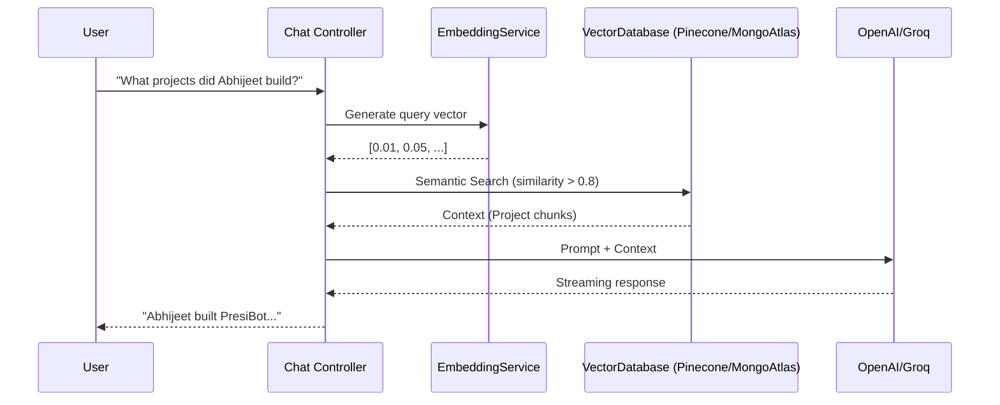
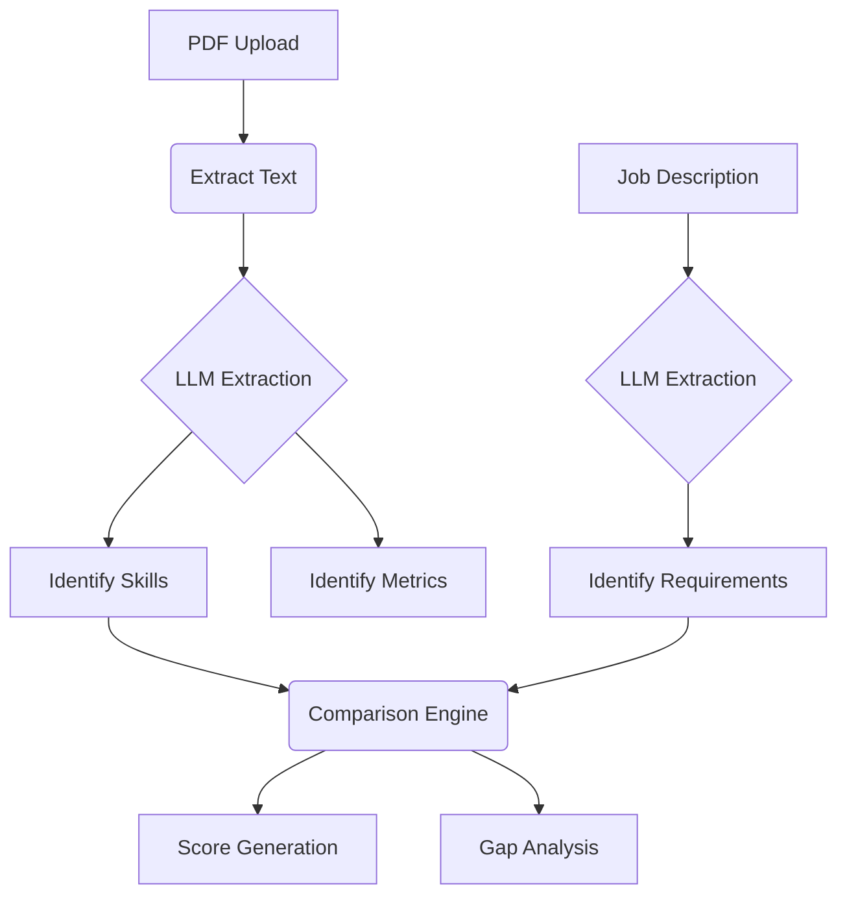

# Phase 7: AI Assistant & Ecosystem Architecture

## RAG (Retrieval-Augmented Generation) Architecture

## Resume Intelligence Pipeline

## API Contracts

### AI Assistant
- `POST /api/v1/assistant/chat` -> Accepts `{ message, history }`, returns `stream`
- `GET /api/v1/assistant/history` -> Fetch chat session history

### Resume Intelligence
- `POST /api/v1/resume/analyze` -> Analyze uploaded PDF against Job Description
- `POST /api/v1/resume/score` -> Return detailed JSON metric analysis

### GitHub & Analytics
- `POST /api/v1/github/sync` -> Trigger Background Queue (BullMQ) for Repo Sync
- `GET /api/v1/analytics/overview` -> Aggregation pipeline for Dashboard Quick Stats
