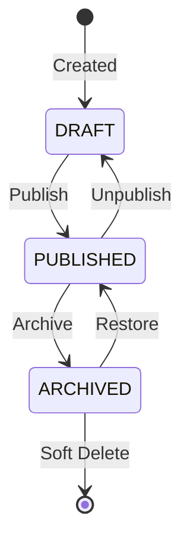
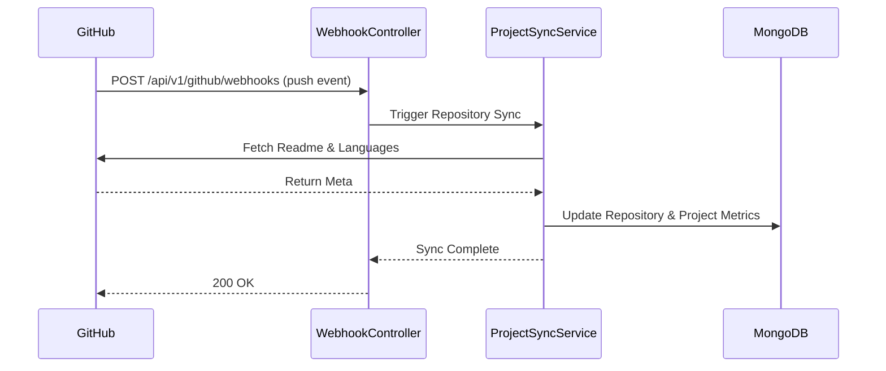

# Phase 5: Projects CMS & GitHub Engine

## Project States Flow

## GitHub Webhook Synchronization Flow

## API Contracts

### Projects
- `GET /api/v1/projects` -> Fetch dynamic projects (featured, latest, filtered)
- `GET /api/v1/projects/:slug` -> View single project
- `POST /api/v1/projects` -> Create project (Admin)
- `PATCH /api/v1/projects/:id` -> Update project (Admin)
- `DELETE /api/v1/projects/:id` -> Soft Delete
- `POST /api/v1/projects/:id/publish` -> Change status to PUBLISHED
- `POST /api/v1/projects/:id/archive` -> Change status to ARCHIVED

### GitHub
- `GET /api/v1/github/repositories` -> Fetch cached repositories
- `POST /api/v1/github/sync` -> Force manual sync
- `POST /api/v1/github/webhooks` -> Handle GitHub hooks
- `GET /api/v1/github/stats` -> Overview metrics (commits, stars)
